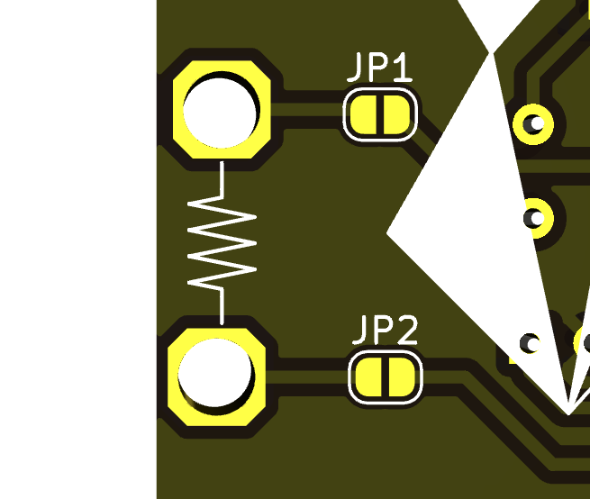

# phoskoto

Controlador de motor PWM por luz o sombra. El nombre viene de la conexión de los conceptos griegos φῶς (phôs, "luz") y σκότος (skótos, "oscuridad")

## Especificaciones

- 1 salida para motor de 6v a 12v hasta 1A configurable
- Control de velocidad vía potenciómetro
- Control de velocidad vía luz o sombra (configurable)
- Botón para movimiento de máxima intensidad (bug)
- Salida directa de PWM de 555 opcional
- Configuración para ser utilizado como oscilador basado en resistencia experimental (si se remueven algunos componentes)
- La alimentación se puede linkear a otra Phoskoto (límite depende del tamaño de la fuente de poder original)

## Esquemático

[Esquemático en pdf](./archivos/phoskoto-sch.pdf)

## Modos de funcionamiento

### 1. Modo potenciómetro

Este modo regula de manera sencilla la velocidad de giro del motor según el potenciómetro de manera directa

- No instalar ningún JUMPER en LINK (pueden guardarse en GUARDA JUMPER)
- No ubicar ningún LDR

### 2. Modo LUZ

En este modo, hay una relación directa LUZ a MOVIMIENTO (La sombra detiene)

- Instalar jumper en LINK derecho
- Instalar LDR en PHOS

### 3. Modo OSCURIDAD

En este modo, hay una relación directa SOMBRA a MOVIMIENTO (La luz detiene)

- Instalar jumper en LINK izquierdo
- Instalar LDR en SKOTO

### 4. Modo resistencia experimental

Convierte el la resistencia al tacto sobre el símbolo de resistencia al costado izquierdo en un oscilador de onda cuadrada en la salida

- No soldar D3 ni D2
- No instalar LDRs
- Puntear LINK izquierdo, y los pads JP1 y JP2 con soldadura

## Ajuste de voltaje para motor

Puedes seleccionar con un jumper si quieres mover motores con 6 o 12V (Si el motor es de 6v se puede dañar si le das 12v)

## BOM

[Descarga en .csv](./archivos/phoskoto-bom.csv)

| Referencia        | Cantidad | Valor    | Componente                         | Encapsulado                                              | OBS                                          |
|-------------------|----------|----------|------------------------------------|----------------------------------------------------------|----------------------------------------------|
| R1,R2,R3,R5,R11   | 5        | 1k       | Resistor                           | THT 1/4w 6.3mm                                           |                                              |
| R4,R8             | 2        | 100k     | Resistor                           | THT 1/4w 6.3mm                                           |                                              |
| D2,D3             | 2        | 1n4148   | Diodo                              | Diodo DO-35                                              |                                              |
| D4,D5             | 2        | 1n4007   | Diodo                              | Diodo DO-41                                              |                                              |
| C1,C4             | 2        | 100n     | Condensador                        | Condensador THT 6x2.5mm                                  |                                              |
| C2                | 1        | 470p     | Condensador                        | Condensador THT 6x2.5mm                                  |                                              |
| C3                | 1        | 100u     | Condensador electrolítico          | Condensador THT Radial 5x2.5mm                           |                                              |
| C5,C6*             | 2        | 10u      | Condensador electrolítico          | Condensador THT Radial 5x2.5mm                           |                                              |
| D1,D6             | 2        | LED      | LED                                | LED 3mm                                                  |                                              |
| J1,J3             | 2        | JACKDC   | Barrel Jack                        | Barrel jack 2.1mm                                        |                                              |
| J2                | 1        | PH 3p    | Pin Header 3p                      | Pin Header 1x3 2.54mm                                    | Selector de voltaje                          |
| LINK, LINK, J6,J8 | 7        | PH 2p    | Pin Header 2p                      | Pin Header 1x2 2.54mm                                    | Guarda jumpers, LINK                         |
| 555 OUT,          | 5        | PS-2     | Pin Socket 2p                      | Pin Socket 1x2 2.54mm                                    |                                              |
| R6,R7             | 2        | PS 2p    | Pin Socket 2p                      | Pin Socket 1x2 2.54mm                                    | En solo 1 va LDR                             |
| M1                | 1        | TBlock   | Terminal Block                     | Terminal Block 2p 5mm                                    |                                              |
| Q1                | 1        | IRFZ44n  | Transistor MOSFET                  | TO-220                                                   |                                              |
| RV1               | 1        | 100k     | Potenciómetro                      | PTV09                                                    |                                              |
| SW1,SW2           | 2        | SW_SPDT  | Switch spdt                        | ss12d00g3                                                |                                              |
| SW3               | 1        | SW_PUSH  | Botón push                         | COM-11992                                                |                                              |
| U1                | 1        | NE555    | Circuito integrado                 | DIP-8                                                    |                                              |
| U1                | 1        | Base     | Base para circuito integrado DIP-8 | DIP-8                                                    |                                              |
| U2                | 1        | L7805    | Regulador de ovltaje               | TO-220                                                   |                                              |
| LDR, LDR          | 1        | LDR 1M   | LDR                                | LDR 5 x 4.1 mm                                           | Se ubica manualmente según modo luz o sombra |
| MOTOR             | 1        | 6v o 12v | Motor DC                           | Cualquier motor de 5 a 12v (adaptar selector de voltaje) |                                              |
| Power supply      | 1        | 12v      | Fuente de poder AC-DC              | 12v / >1A / 2.1mm centro positivo                        |                                              |

*C6 es opcional. Ayuda a desacelerar enormemente el comportamiento del circuito. Útil si lo estás utilizando con un parlante y quieres cambiar la octava

## Bug conocidos de versión 250623

- R4 no está conectada al pin 1 del IRFZ44n. Puede causar inestabilidad en el MOSFET
- La salida del 555 por defecto está en ON si se inhabilita su RESET, por lo que el comportamiento de TEMPORAL está invertido

## Esquemas para conexión

